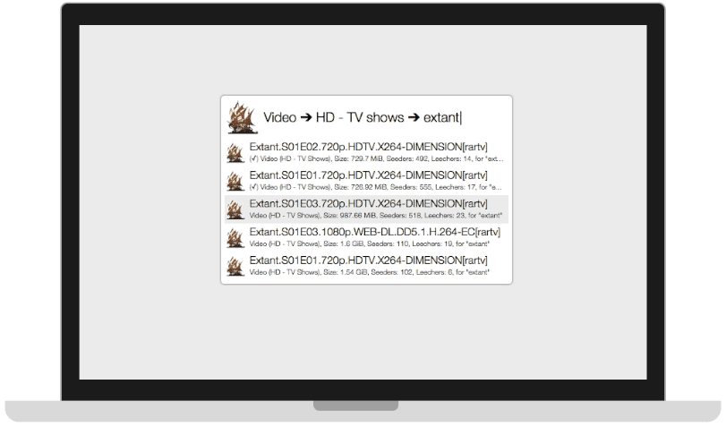

alfred-workflow-mockup
======================

Template webpage to demo your amazing workflows. [> See demo here](http://sheraff.github.io/alfred-workflow-mockup/)

## summary
Through a very straightforward script (see json script in `script_example.js`), this framework allows you to demo how your workflows work thanks to an **Alfred mockup**, a simple **OSX notifications** system and a **key modifiers** display.



## how to script
The script is a simple array of states, each described by a json string. All elements are optional and have a default state (either hidden of placeholders). Here’s a list of possible elements:
- `duration`: duration of the state in milliseconds.
```
// Example
"duration": 1000
```

- `keypress`: emits a *pressed key* display of the specified string (similar to the *volume up* or *volume down* notifications on OSX) at the beginning of the state. The display fades out in 1 second.
```
// Example
"keypress": "⇥"
```

- `notification`: emits an *osx notification* (similar to all the notifications you can see on the top right corner of your screen under OSX) at the beginning of the state. The notification enters, stills, and pans out in 4 seconds. Sub-elements are:
  - `title`: the main text of the notification
  - `sub`: the secondary text, written smaller and in grey.
```
// Example
"notification": {
	"title": "Le Coucou (1980)",
	"sub": "Download started..."
}
```

- `alfred`: describes the composition of the alfred mockup. Remove to hide Alfred. Sub-elements are:
  - `title`: the query typed in alfred
  - `icon`: main icon of the current workflow (this is similar to when alfred is called with a hotkey). Leave empty to default to Alfred’s icon.
  - `list`: an array of json strings to describe the results shown in alfred. Each element is composed of:
    - `title`: Main text of the result
    - `sub`: Secondary text of the result
    - `icon`: small icon for the result, leave empty to default to the main icon defined before.
    - `selected`: boolean to indicate the selected result. If no result is described as selected, the first result is selected.
```
// Example
"alfred": {
	"title": "coucou0",
	"icon": "imgs/icon.png",
	"list": [{
		"title": "Le Coucou (1980)",
		"sub": "Video (Movie), 800Mb, Seed: 10, Leech: 20",
		"icon": "imgs/icon.png",
		"selected": true
	}, {
		"title": "Vol au dessus d'un nid de coucou.French DVDRip [Sheraff]",
		"icon": "imgs/icon.png"
	}]
}
```

- `callback`: function to be called when this state is displayed (only when reading the script with `play_script()`, ignored when using `echo_state()`). Send the index of the state as an argument.
```
// Example
"callback": my_function
```

## how to play the script
There are 2 functions that allow you to use what you scripted:
- `echo_state(state)` put the simulation in the provided state. If some notification / key modifiers were on the screen, they will fade away normally unless replaced by the provided state.
```
// Example
echo_state(script[0]) //to put in initial position
```
- `play_script(script, from, to, loop, start_at)` will take care of playing the whole script based on the given parameters:
  - `script` is the script you want to follow
  - `from` (defaults to `0`) is the first state to be displayed, 
  - `to` (defaults to `0`) is the last+1 (use `0` or `script.length` to play the whole script)
  - `loop` (defaults to `true`) is a boolean to indicate whether or not to go back to (`from`) when `to` is reached
  - `start_at` (defaults to the value of `from`) is where the playhead starts at
```
// Examples
play_script(script) //play and loop the whole script
play_script(script, 3) //play and loop the whole script except frames 0, 1 and 2
play_script(script, 2, 5, false) //play frames 2, 3, 4 and stop 
```
